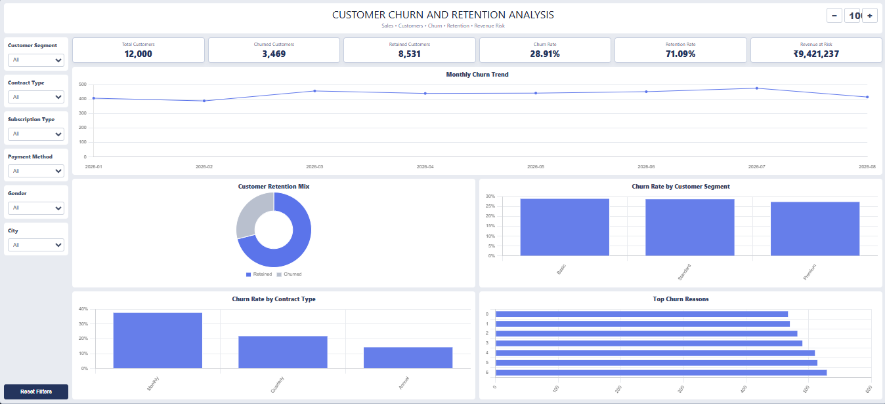

# Customer Churn & Retention Analysis

An end-to-end customer churn and retention analytics project using **Python, SQL, and Power BI**. The project covers data validation, exploratory analysis, business-focused SQL analysis, churn and retention metrics, revenue-at-risk analysis, customer segmentation, and an interactive dashboard.

## Project Overview

Customer churn is a critical business problem because losing customers directly affects recurring revenue and long-term customer value.

This project analyzes customer, activity, subscription, and churn data to identify:

- Overall customer churn and retention performance
- High-churn customer segments
- Churn patterns across contract and subscription types
- Common reasons for customer churn
- Customer engagement patterns associated with churn
- Monthly churn trends
- Monthly revenue exposed to churn
- High-value customers who have churned
- Customers showing potential retention risk

## Business Objective

The primary objective is to convert raw customer data into actionable retention insights that can support data-driven decisions.

The analysis is designed to help businesses:

1. Identify customer groups with elevated churn risk.
2. Understand the main drivers of customer attrition.
3. Quantify the recurring revenue exposed to churn.
4. Prioritize customers and segments for retention campaigns.
5. Monitor churn trends and retention KPIs.

## Dashboard Preview



The dashboard provides an executive view of customer churn and retention performance.

### Dashboard Components

- Total Customers
- Churned Customers
- Retained Customers
- Churn Rate
- Retention Rate
- Monthly Revenue at Risk
- Monthly Churn Trend
- Customer Retention Mix
- Churn Rate by Customer Segment
- Churn Rate by Contract Type
- Top Churn Reasons

### Interactive Filters

- Customer Segment
- Contract Type
- Subscription Type
- Payment Method
- Gender
- City

## Dataset

The project contains three source datasets.

| Dataset | Description |
|---|---|
| `churn_raw.csv` | Customer churn status, churn date, and churn reason |
| `customer_activity_raw.csv` | Customer demographics, engagement, usage, support activity, and tenure |
| `subscriptions_raw.csv` | Contract, subscription, payment, and subscription date information |

### Cleaned Datasets

| Dataset | Purpose |
|---|---|
| `churn_cleaned.csv` | Validated churn information |
| `customer_activity_cleaned.csv` | Validated customer activity and demographic information |
| `subscriptions_cleaned.csv` | Validated subscription information |

Each cleaned dataset contains **12,000 records**, with customer IDs validated across the three tables.

## Data Validation

The project includes data-quality checks for:

- Row counts
- Duplicate customer IDs
- Missing values
- Invalid customer IDs
- Invalid numeric values
- Churn records without churn dates
- Churn records without churn reasons
- Customer ID consistency across datasets

Validation of the project datasets confirmed:

- 12,000 customers
- No duplicate customer IDs in the individual datasets
- No missing customer IDs
- 3,469 churned customers
- 8,531 retained customers

## Key Analytical Results

The validated analysis shows:

| Metric | Result |
|---|---:|
| Total Customers | 12,000 |
| Churned Customers | 3,469 |
| Retained Customers | 8,531 |
| Churn Rate | 28.91% |
| Retention Rate | 71.09% |
| Monthly Revenue at Risk | 9,421,236.55 |

### Segment Analysis

The churn rates by customer segment are:

| Customer Segment | Churn Rate |
|---|---:|
| Basic | 29.24% |
| Standard | 29.02% |
| Premium | 27.61% |

### Contract Analysis

Contract type shows a stronger difference in churn:

| Contract Type | Churn Rate |
|---|---:|
| Monthly | 37.97% |
| Quarterly | 22.18% |
| Annual | 14.66% |

The monthly contract group has the highest churn rate, making it an important area for retention initiatives.

### Leading Churn Reasons

The most frequently recorded churn reasons include:

1. Competitor
2. Customer Support
3. Technical Issues
4. Other
5. Poor Service
6. High Price
7. Not Using Product

## Python Analysis

Python is used for data preparation, validation, exploratory analysis, KPI calculation, segmentation, and business insights.

### Main Python Tasks

- Load cleaned datasets
- Validate data quality
- Prepare the analysis dataset
- Calculate churn and retention KPIs
- Analyze customer segments
- Analyze contract and subscription types
- Analyze payment methods
- Analyze customer engagement
- Analyze login activity
- Analyze support tickets
- Analyze monthly usage
- Analyze customer tenure
- Analyze demographic patterns
- Analyze churn by city
- Analyze churn reasons
- Analyze monthly churn trends
- Calculate revenue at risk
- Identify high-value churned customers
- Identify low-engagement retained customers
- Build customer risk segments
- Generate an executive summary

### Python Libraries

- Pandas
- NumPy
- Matplotlib

## SQL Analysis

SQL is used for data-quality validation and business analysis.

The SQL analysis includes:

- Row-count validation
- Duplicate checks
- Missing-value checks
- Numeric range checks
- Overall churn and retention KPIs
- Churned versus retained customer analysis
- Churn by customer segment
- Churn by contract type
- Churn by subscription type
- Churn by payment method
- Customer engagement analysis
- Login activity analysis
- Support-ticket analysis
- Monthly usage analysis
- Tenure analysis
- Churn reason analysis
- Monthly churn trend analysis
- Revenue-at-risk analysis
- High-value churned customer analysis
- Customer risk segmentation
- Segment and contract analysis

## Power BI Dashboard

Power BI is used to present the analytical results through an interactive executive dashboard.

The dashboard focuses on:

- KPI monitoring
- Churn and retention performance
- Monthly churn trends
- Segment-level churn
- Contract-level churn
- Churn reasons
- Revenue exposure
- Interactive filtering

The dashboard preview is available at:

`/screenshot/dashboard-preview.png`

## Business Recommendations

Based on the analysis:

1. Prioritize customers on monthly contracts for retention initiatives because this group has the highest observed churn rate.
2. Investigate competitor-related churn and strengthen customer value propositions.
3. Address customer-support and technical issues that contribute significantly to churn.
4. Monitor high-value churned customers and the revenue associated with them.
5. Use customer engagement indicators such as login activity and usage to identify customers requiring proactive intervention.
6. Track monthly churn and revenue-at-risk KPIs to measure the effectiveness of retention strategies.

## Project Structure

```text
Customer-churn-retention-analysis/
|
|-- Raw_data_Set/
|   |-- churn_raw.csv
|   |-- customer_activity_raw.csv
|   `-- subscriptions_raw.csv
|
|-- cleaned data/
|   |-- churn_cleaned.csv
|   |-- customer_activity_cleaned.csv
|   `-- subscriptions_cleaned.csv
|
|-- Phyton/
|   `-- Customer_Churn_Retention_Analysis.ipynb
|
|-- SQL/
|   `-- Customer_Churn_Retention_SQL_Analysis.sql
|
|-- screenshot/
|   `-- dashboard-preview.png
|
`-- README.md
```

## Tools and Technologies

| Area | Tools |
|---|---|
| Programming | Python |
| Data Analysis | Pandas, NumPy |
| Visualization | Matplotlib, Power BI |
| Database Analysis | SQL |
| Dashboarding | Power BI |
| Data Preparation | Python, SQL |
| Business Analysis | Churn, Retention, Segmentation, Revenue-at-Risk |

## Skills Demonstrated

- Data Cleaning and Validation
- Exploratory Data Analysis
- SQL Business Analysis
- KPI Development
- Customer Segmentation
- Churn Analysis
- Retention Analysis
- Customer Engagement Analysis
- Revenue-at-Risk Analysis
- Data Visualization
- Power BI Dashboard Development
- Business Insight Generation

## Author

**Sai Teja Battina**

Data Analyst | Python | SQL | Power BI | Excel

GitHub: https://github.com/SaiTeja2895
